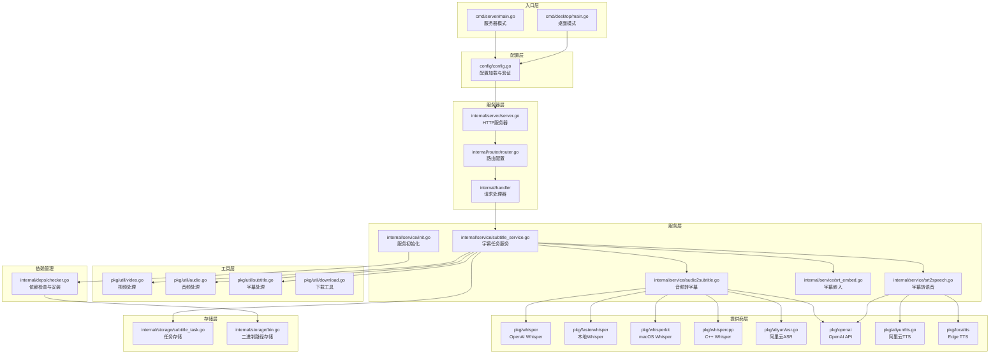
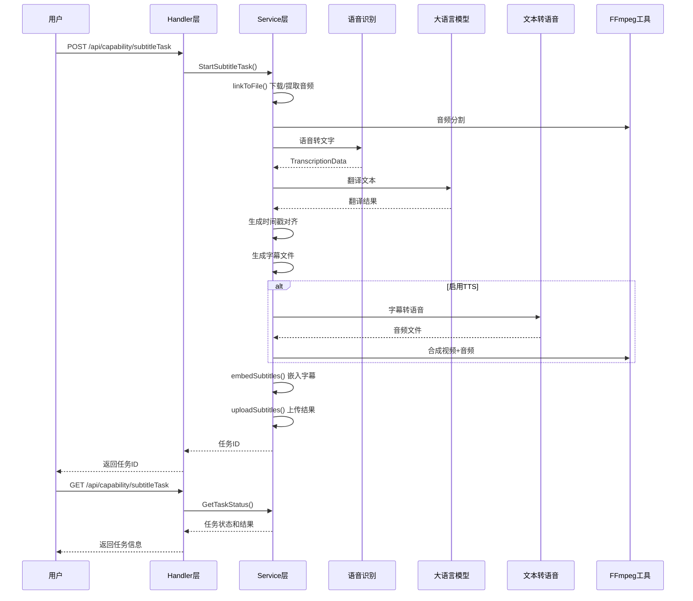
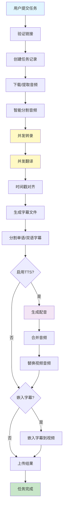

# KrillinAI 项目架构分析文档

## 1. 项目概述

### 1.1 项目定位
KrillinAI 是一个极简主义的 AI 视频翻译和配音工具，由 Krillin AI 开发。该项目集成了视频翻译、配音和声音克隆功能，支持横屏和竖屏格式，确保在所有主要平台（Bilibili、小红书、抖音、微信视频、快手、YouTube、TikTok 等）上完美呈现。

### 1.2 核心价值
- **端到端工作流**：从原始素材到可直接使用的跨平台内容，只需几次点击
- **多平台支持**：支持 Windows、Linux、macOS，提供桌面版和服务器版
- **灵活配置**：支持多种语音识别服务、大语言模型和 TTS 服务
- **自动化处理**：自动依赖安装、模型下载、音频分割、字幕对齐等

### 1.3 技术栈
- **编程语言**：Go 1.22+
- **Web 框架**：Gin
- **桌面框架**：Fyne v2
- **配置管理**：TOML (BurntSushi/toml)
- **日志系统**：Zap (Uber)
- **并发控制**：golang.org/x/sync/errgroup
- **外部工具**：FFmpeg、yt-dlp、Whisper 系列

## 2. 整体架构

### 2.1 架构图



### 2.2 模块划分

项目采用分层架构设计，主要分为以下几个层次：

1. **入口层 (cmd/)**
   - `cmd/server/`: 服务器模式入口
   - `cmd/desktop/`: 桌面应用入口

2. **配置层 (config/)**
   - 配置文件的加载、验证和保存

3. **接口层 (internal/)**
   - `internal/router/`: 路由定义
   - `internal/handler/`: HTTP 请求处理
   - `internal/response/`: 响应封装
   - `internal/dto/`: 数据传输对象

4. **服务层 (internal/service/)**
   - 核心业务逻辑实现

5. **提供商层 (pkg/)**
   - 各种第三方服务的封装

6. **工具层 (pkg/util/)**
   - 通用工具函数

7. **存储层 (internal/storage/)**
   - 内存存储和路径管理

8. **依赖管理层 (internal/deps/)**
   - 自动检查和安装依赖

### 2.3 数据流



## 3. 核心模块分析

### 3.1 入口层 (cmd/)

#### 3.1.1 服务器模式 (cmd/server/main.go)

```12:34:cmd/server/main.go
func main() {
	log.InitLogger()
	defer log.GetLogger().Sync()

	var err error
	if !config.LoadConfig() {
		return
	}

	if err = config.CheckConfig(); err != nil {
		log.GetLogger().Error("加载配置失败", zap.Error(err))
		return
	}

	if err = deps.CheckDependency(); err != nil {
		log.GetLogger().Error("依赖环境准备失败", zap.Error(err))
		return
	}
	if err = server.StartBackend(); err != nil {
		log.GetLogger().Error("后端服务启动失败", zap.Error(err))
		os.Exit(1)
	}
}
```

**核心功能**：
- 初始化日志系统
- 加载和验证配置文件
- 检查并安装依赖（FFmpeg、yt-dlp、Whisper 等）
- 启动 HTTP 服务器

#### 3.1.2 桌面模式 (cmd/desktop/main.go)

```12:32:cmd/desktop/main.go
func main() {
	log.InitLogger()
	defer log.GetLogger().Sync()

	if !config.LoadConfig() {
		// 确保有最基础的配置
		err := config.SaveConfig()
		if err != nil {
			log.GetLogger().Error("保存配置失败", zap.Error(err))
			os.Exit(1)
		}
	}
	go func() {
		if err := server.StartBackend(); err != nil {
			log.GetLogger().Error("后端服务启动失败", zap.Error(err))
			os.Exit(1)
		}
	}()
	config.ConfigBackup = config.Conf
	desktop.Show()
}
```

**核心功能**：
- 在后台启动 HTTP 服务器
- 显示桌面 GUI 界面
- 自动创建默认配置（如果不存在）

### 3.2 配置层 (config/)

#### 3.2.1 配置结构

```87:133:config/config.go
type Config struct {
	App        App                    `toml:"app"`
	Server     Server                 `toml:"server"`
	Llm        OpenaiCompatibleConfig `toml:"llm"`
	Transcribe Transcribe             `toml:"transcribe"`
	Tts        Tts                    `toml:"tts"`
}

var Conf = Config{
	App: App{
		SegmentDuration:       5,
		TranslateParallelNum:  3,
		TranscribeParallelNum: 1,
		TranscribeMaxAttempts: 3,
		TranslateMaxAttempts:  3,
		MaxSentenceLength:     70,
	},
	Server: Server{
		Host: "127.0.0.1",
		Port: 8888,
	},
	Llm: OpenaiCompatibleConfig{
		Model: "gpt-4o-mini",
	},
	Transcribe: Transcribe{
		Provider:              "openai",
		EnableGpuAcceleration: false, // 默认不开启GPU加速
		Openai: OpenaiCompatibleConfig{
			Model: "whisper-1",
		},
		Fasterwhisper: LocalModelConfig{
			Model: "large-v2",
		},
		Whisperkit: LocalModelConfig{
			Model: "large-v2",
		},
		Whispercpp: LocalModelConfig{
			Model: "large-v2",
		},
	},
	Tts: Tts{
		Provider: "openai",
		Openai: OpenaiCompatibleConfig{
			Model: "gpt-4o-mini-tts",
		},
	},
}
```

**配置说明**：
- `App`: 应用级配置（并发数、重试次数、句子长度等）
- `Server`: 服务器配置（主机、端口）
- `Llm`: 大语言模型配置（支持 OpenAI 兼容 API）
- `Transcribe`: 语音识别配置（支持多种提供商）
- `Tts`: 文本转语音配置

### 3.3 服务层 (internal/service/)

#### 3.3.1 服务初始化 (internal/service/init.go)

```26:68:internal/service/init.go
func NewService() *Service {
	var transcriber types.Transcriber
	var chatCompleter types.ChatCompleter
	var ttsClient types.Ttser

	switch config.Conf.Transcribe.Provider {
	case "openai":
		transcriber = whisper.NewClient(config.Conf.Transcribe.Openai.BaseUrl, config.Conf.Transcribe.Openai.ApiKey, config.Conf.App.Proxy)
	case "fasterwhisper":
		transcriber = fasterwhisper.NewFastwhisperProcessor(config.Conf.Transcribe.Fasterwhisper.Model)
	case "whispercpp":
		transcriber = whispercpp.NewWhispercppProcessor(config.Conf.Transcribe.Whispercpp.Model)
	case "whisperkit":
		transcriber = whisperkit.NewWhisperKitProcessor(config.Conf.Transcribe.Whisperkit.Model)
	case "aliyun":
		cc, err := aliyun.NewAsrClient(config.Conf.Transcribe.Aliyun.Speech.AccessKeyId, config.Conf.Transcribe.Aliyun.Speech.AccessKeySecret, config.Conf.Transcribe.Aliyun.Speech.AppKey, true)
		if err != nil {
			log.GetLogger().Error("创建阿里云语音识别客户端失败： ", zap.Error(err))
			return nil
		}
		transcriber = cc
	}
	log.GetLogger().Info("当前选择的转录源： ", zap.String("transcriber", config.Conf.Transcribe.Provider))

	chatCompleter = openai.NewClient(config.Conf.Llm.BaseUrl, config.Conf.Llm.ApiKey, config.Conf.App.Proxy)

	switch config.Conf.Tts.Provider {
	case "openai":
		ttsClient = openai.NewClient(config.Conf.Tts.Openai.BaseUrl, config.Conf.Tts.Openai.ApiKey, config.Conf.App.Proxy)
	case "aliyun":
		ttsClient = aliyun.NewTtsClient(config.Conf.Tts.Aliyun.Speech.AccessKeyId, config.Conf.Tts.Aliyun.Speech.AccessKeySecret, config.Conf.Tts.Aliyun.Speech.AppKey)
	case "edge-tts":
		ttsClient = localtts.NewEdgeTtsClient()
	}

	return &Service{
		Transcriber:      transcriber,
		ChatCompleter:    chatCompleter,
		TtsClient:        ttsClient,
		OssClient:        aliyun.NewOssClient(config.Conf.Transcribe.Aliyun.Oss.AccessKeyId, config.Conf.Transcribe.Aliyun.Oss.AccessKeySecret, config.Conf.Transcribe.Aliyun.Oss.Bucket),
		VoiceCloneClient: aliyun.NewVoiceCloneClient(config.Conf.Tts.Aliyun.Speech.AccessKeyId, config.Conf.Tts.Aliyun.Speech.AccessKeySecret, config.Conf.Tts.Aliyun.Speech.AppKey),
	}
}
```

**设计模式**：策略模式（Strategy Pattern）
- 根据配置动态选择不同的提供商实现
- 通过接口抽象，实现可插拔的架构

#### 3.3.2 字幕任务服务 (internal/service/subtitle_service.go)

**核心流程**：

```20:188:internal/service/subtitle_service.go
func (s Service) StartSubtitleTask(req dto.StartVideoSubtitleTaskReq) (*dto.StartVideoSubtitleTaskResData, error) {
	// 校验链接
	if strings.Contains(req.Url, "youtube.com") {
		videoId, _ := util.GetYouTubeID(req.Url)
		if videoId == "" {
			return nil, fmt.Errorf("链接不合法")
		}
	}
	if strings.Contains(req.Url, "bilibili.com") {
		videoId := util.GetBilibiliVideoId(req.Url)
		if videoId == "" {
			return nil, fmt.Errorf("链接不合法")
		}
	}
	// 生成任务id
	seperates := strings.Split(req.Url, "/")
	taskId := fmt.Sprintf("%s_%s", util.SanitizePathName(string([]rune(strings.ReplaceAll(seperates[len(seperates)-1], " ", ""))[:16])), util.GenerateRandStringWithUpperLowerNum(4))
	taskId = strings.ReplaceAll(taskId, "=", "") // 等于号影响ffmpeg处理
	taskId = strings.ReplaceAll(taskId, "?", "") // 问号影响ffmpeg处理
	// 构造任务所需参数
	var resultType types.SubtitleResultType
	// 根据入参选项确定要返回的字幕类型
	if req.TargetLang == "none" {
		resultType = types.SubtitleResultTypeOriginOnly
	} else {
		if req.Bilingual == types.SubtitleTaskBilingualYes {
			if req.TranslationSubtitlePos == types.SubtitleTaskTranslationSubtitlePosTop {
				resultType = types.SubtitleResultTypeBilingualTranslationOnTop
			} else {
				resultType = types.SubtitleResultTypeBilingualTranslationOnBottom
			}
		} else {
			resultType = types.SubtitleResultTypeTargetOnly
		}
	}
	// 文字替换map
	replaceWordsMap := make(map[string]string)
	if len(req.Replace) > 0 {
		for _, replace := range req.Replace {
			beforeAfter := strings.Split(replace, "|")
			if len(beforeAfter) == 2 {
				replaceWordsMap[beforeAfter[0]] = beforeAfter[1]
			} else {
				log.GetLogger().Info("generateAudioSubtitles replace param length err", zap.Any("replace", replace), zap.Any("taskId", taskId))
			}
		}
	}
	var err error
	ctx := context.Background()
	// 创建字幕任务文件夹
	taskBasePath := filepath.Join("./tasks", taskId)
	if _, err = os.Stat(taskBasePath); os.IsNotExist(err) {
		// 不存在则创建
		err = os.MkdirAll(filepath.Join(taskBasePath, "output"), os.ModePerm)
		if err != nil {
			log.GetLogger().Error("StartVideoSubtitleTask MkdirAll err", zap.Any("req", req), zap.Error(err))
		}
	}

	// 创建任务
	taskPtr := &types.SubtitleTask{
		TaskId:   taskId,
		VideoSrc: req.Url,
		Status:   types.SubtitleTaskStatusProcessing,
	}
	storage.SubtitleTasks.Store(taskId, taskPtr)

	// 处理声音克隆源
	var voiceCloneAudioUrl string
	if req.TtsVoiceCloneSrcFileUrl != "" {
		localFileUrl := strings.TrimPrefix(req.TtsVoiceCloneSrcFileUrl, "local:")
		fileKey := util.GenerateRandStringWithUpperLowerNum(5) + filepath.Ext(localFileUrl) // 防止url encode的问题，这里统一处理
		err = s.OssClient.UploadFile(context.Background(), fileKey, localFileUrl, s.OssClient.Bucket)
		if err != nil {
			log.GetLogger().Error("StartVideoSubtitleTask UploadFile err", zap.Any("req", req), zap.Error(err))
			return nil, errors.New("上传声音克隆源失败")
		}
		voiceCloneAudioUrl = fmt.Sprintf("https://%s.oss-cn-shanghai.aliyuncs.com/%s", s.OssClient.Bucket, fileKey)
		log.GetLogger().Info("StartVideoSubtitleTask 上传声音克隆源成功", zap.Any("oss url", voiceCloneAudioUrl))
	}

	stepParam := types.SubtitleTaskStepParam{
		TaskId:                  taskId,
		TaskPtr:                 taskPtr,
		TaskBasePath:            taskBasePath,
		Link:                    req.Url,
		SubtitleResultType:      resultType,
		EnableModalFilter:       req.ModalFilter == types.SubtitleTaskModalFilterYes,
		EnableTts:               req.Tts == types.SubtitleTaskTtsYes,
		TtsVoiceCode:            req.TtsVoiceCode,
		VoiceCloneAudioUrl:      voiceCloneAudioUrl,
		ReplaceWordsMap:         replaceWordsMap,
		OriginLanguage:          types.StandardLanguageCode(req.OriginLanguage),
		TargetLanguage:          types.StandardLanguageCode(req.TargetLang),
		UserUILanguage:          types.StandardLanguageCode(req.Language),
		EmbedSubtitleVideoType:  req.EmbedSubtitleVideoType,
		VerticalVideoMajorTitle: req.VerticalMajorTitle,
		VerticalVideoMinorTitle: req.VerticalMinorTitle,
		MaxWordOneLine:          12, // 默认值
	}
	if req.OriginLanguageWordOneLine != 0 {
		stepParam.MaxWordOneLine = req.OriginLanguageWordOneLine
	}

	log.GetLogger().Info("current task info", zap.String("taskId", taskId), zap.Any("param", stepParam))

	go func() {
		defer func() {
			if r := recover(); r != nil {
				const size = 64 << 10
				buf := make([]byte, size)
				buf = buf[:runtime.Stack(buf, false)]
				log.GetLogger().Error("autoVideoSubtitle panic", zap.Any("panic:", r), zap.Any("stack:", buf))
				stepParam.TaskPtr.Status = types.SubtitleTaskStatusFailed
			}
		}()
		// 新版流程：链接->本地音频文件->视频信息获取（若有）->本地字幕文件->语言合成->视频合成->字幕文件链接生成
		log.GetLogger().Info("video subtitle start task", zap.String("taskId", taskId))
		err = s.linkToFile(ctx, &stepParam)
		if err != nil {
			log.GetLogger().Error("StartVideoSubtitleTask linkToFile err", zap.Any("req", req), zap.Error(err))
			stepParam.TaskPtr.Status = types.SubtitleTaskStatusFailed
			stepParam.TaskPtr.FailReason = err.Error()
			return
		}
		// 暂时不加视频信息
		//err = s.getVideoInfo(ctx, &stepParam)
		//if err != nil {
		//	log.GetLogger().Error("StartVideoSubtitleTask getVideoInfo err", zap.Any("req", req), zap.Error(err))
		//	stepParam.TaskPtr.Status = types.SubtitleTaskStatusFailed
		//	stepParam.TaskPtr.FailReason = "get video info error"
		//	return
		//}
		err = s.audioToSubtitle(ctx, &stepParam)
		if err != nil {
			log.GetLogger().Error("StartVideoSubtitleTask audioToSubtitle err", zap.Any("req", req), zap.Error(err))
			stepParam.TaskPtr.Status = types.SubtitleTaskStatusFailed
			stepParam.TaskPtr.FailReason = err.Error()
			return
		}
		err = s.srtFileToSpeech(ctx, &stepParam)
		if err != nil {
			log.GetLogger().Error("StartVideoSubtitleTask srtFileToSpeech err", zap.Any("req", req), zap.Error(err))
			stepParam.TaskPtr.Status = types.SubtitleTaskStatusFailed
			stepParam.TaskPtr.FailReason = err.Error()
			return
		}
		err = s.embedSubtitles(ctx, &stepParam)
		if err != nil {
			log.GetLogger().Error("StartVideoSubtitleTask embedSubtitles err", zap.Any("req", req), zap.Error(err))
			stepParam.TaskPtr.Status = types.SubtitleTaskStatusFailed
			stepParam.TaskPtr.FailReason = err.Error()
			return
		}
		err = s.uploadSubtitles(ctx, &stepParam)
		if err != nil {
			log.GetLogger().Error("StartVideoSubtitleTask uploadSubtitles err", zap.Any("req", req), zap.Error(err))
			stepParam.TaskPtr.Status = types.SubtitleTaskStatusFailed
			stepParam.TaskPtr.FailReason = err.Error()
			return
		}

		log.GetLogger().Info("video subtitle task end", zap.String("taskId", taskId))
	}()

	return &dto.StartVideoSubtitleTaskResData{
		TaskId: taskId,
	}, nil
}
```

**关键特性**：
- 异步任务处理（goroutine）
- 任务状态管理（Processing/Success/Failed）
- 错误恢复机制（panic recover）
- 支持 YouTube、Bilibili 和本地文件

#### 3.3.3 音频转字幕 (internal/service/audio2subtitle.go)

这是最核心的模块，实现了复杂的并发处理流程：

**核心流程**：

```233:569:internal/service/audio2subtitle.go
func (s Service) audioToSrt(ctx context.Context, stepParam *types.SubtitleTaskStepParam) (err error) {
	defer func() {
		if r := recover(); r != nil {
			log.GetLogger().Error("audioToSubtitle audioToSrt panic recovered", zap.Any("panic", r), zap.String("stack", string(debug.Stack())))
			err = fmt.Errorf("audioToSubtitle audioToSrt panic recovered: %v", r)
		}
	}()

	log.GetLogger().Info("audioToSubtitle.audioToSrt start", zap.Any("taskId", stepParam.TaskId))
	timePoints, err := GetSplitPoints(stepParam.AudioFilePath, float64(config.Conf.App.SegmentDuration)*60)
	if err != nil {
		log.GetLogger().Error("audioToSubtitle audioToSrt GetSplitPoints err", zap.Any("taskId", stepParam.TaskId), zap.Error(err))
		return fmt.Errorf("audioToSubtitle audioToSrt GetSplitPoints err: %w", err)
	}
	log.GetLogger().Info("audioToSubtitle audioToSrt GetSplitPoints completed", zap.Any("taskId", stepParam.TaskId), zap.Any("timePoints", timePoints))

	// 更新字幕任务信息
	stepParam.TaskPtr.ProcessPct = 15
	segmentNum := len(timePoints) - 1

	type DataWithId[T any] struct {
		Data T
		Id   int
	}

	var (
		// 待剪辑的音频片段队列
		pendingSplitQueue = make(chan DataWithId[[2]float64], segmentNum)
		// 剪辑结果队列
		splitResultQueue = make(chan DataWithId[string], segmentNum)
		// 待转录的音频文件队列
		pendingTranscriptionQueue = make(chan DataWithId[string], segmentNum)
		// 转录结果队列
		transcribedQueue = make(chan DataWithId[*types.TranscriptionData], segmentNum)
		// 待翻译的文本队列
		pendingTranslationQueue = make(chan DataWithId[string], segmentNum)
		// 翻译结果队列
		translatedQueue = make(chan DataWithId[[]*TranslatedItem], segmentNum)
	)
	eg, ctx := errgroup.WithContext(ctx)

	log.GetLogger().Info("audioToSubtitle.audioToSrt start", zap.Any("taskId", stepParam.TaskId))

	// 构造长度为segmentNum的音频片段切片
	type AudioSegment struct {
		AudioFile         string
		TranscriptionData *types.TranscriptionData
		SrtNoTsFile       string
	}
	audioSegments := make([]AudioSegment, segmentNum)

	// 输入音频文件到分割队列
	for i := range segmentNum {
		pendingSplitQueue <- DataWithId[[2]float64]{
			Data: [2]float64{timePoints[i], timePoints[i+1]},
			Id:   i,
		}
	}

	// 分割音频
	for range runtime.NumCPU() {
		eg.Go(func() error {
			for {
				select {
				case <-ctx.Done():
					return nil
				case splitItem, ok := <-pendingSplitQueue:
					if !ok {
						return nil
					}
					log.GetLogger().Info("Begin split audio", zap.Any("taskId", stepParam.TaskId), zap.Any("splitId", splitItem.Id))
					// 分割音频
					outputFileName := filepath.Join(stepParam.TaskBasePath, fmt.Sprintf(types.SubtitleTaskSplitAudioFileNamePattern, splitItem.Id))
					err := ClipAudio(stepParam.AudioFilePath, outputFileName, splitItem.Data[0], splitItem.Data[1])
					if err != nil {
						return fmt.Errorf("audioToSubtitle audioToSrt ClipAudio err: %w", err)
					}
					log.GetLogger().Info("Split audio completed", zap.Any("taskId", stepParam.TaskId), zap.Any("splitId", splitItem.Id))

					// 发送分割结果
					splitResultQueue <- DataWithId[string]{
						Data: outputFileName,
						Id:   splitItem.Id,
					}
				}
			}
		})
	}

	// 音频转录
	for range config.Conf.App.TranscribeParallelNum {
		eg.Go(func() error {
			for {
				select {
				case <-ctx.Done():
					return nil
				case audioFileItem, ok := <-pendingTranscriptionQueue:
					if !ok {
						return nil
					}
					var (
						err               error
						transcriptionData *types.TranscriptionData
					)
					log.GetLogger().Info("Begin transcribe", zap.Any("taskId", stepParam.TaskId), zap.Any("splitId", audioFileItem.Id))
					// 语音转文字
					for range config.Conf.App.TranscribeMaxAttempts {
						transcriptionData, err = s.transcribeAudio(audioFileItem.Id, audioFileItem.Data, string(stepParam.OriginLanguage), stepParam.TaskBasePath)
						if err == nil {
							break
						}
					}
					if err != nil {
						return fmt.Errorf("audioToSubtitle audioToSrt Transcription err: %w", err)
					}
					log.GetLogger().Info("Transcribe completed", zap.Any("taskId", stepParam.TaskId), zap.Any("splitId", audioFileItem.Id))

					// 发送转录结果
					transcribedQueue <- DataWithId[*types.TranscriptionData]{
						Data: transcriptionData,
						Id:   audioFileItem.Id,
					}
				}
			}
		})
	}

	// 分句+翻译
	eg.Go(func() error {
		for {
			select {
			case <-ctx.Done():
				return nil
			case translateItem, ok := <-pendingTranslationQueue:
				if !ok {
					return nil
				}
				var translatedResults []*TranslatedItem
				var err error
				// 翻译文本
				log.GetLogger().Info("Begin to translate", zap.Any("taskId", stepParam.TaskId), zap.Any("splitId", translateItem.Id))
				for range config.Conf.App.TranslateMaxAttempts {
					translatedResults, err = s.splitTextAndTranslateV2(stepParam.TaskBasePath, translateItem.Data, stepParam.OriginLanguage, stepParam.TargetLanguage, stepParam.EnableModalFilter, translateItem.Id)
					if err == nil {
						break
					}
				}
				if err != nil {
					return fmt.Errorf("audioToSubtitle audioToSrt splitTextAndTranslate err: %w", err)
				}
				_ = util.SaveToDisk(translatedResults, filepath.Join(stepParam.TaskBasePath, fmt.Sprintf(types.SubtitleTaskTranslationDataPersistenceFileNamePattern, translateItem.Id)))
				log.GetLogger().Info("Translate completed", zap.Any("taskId", stepParam.TaskId), zap.Any("splitId", translateItem.Id))
				// 二次分割长句
				splitResults, err := s.splitTranslateItem(translatedResults)
				if err != nil {
					// 不中断
					log.GetLogger().Error("audioToSubtitle audioToSrt splitTranslateItem err", zap.Any("taskId", stepParam.TaskId), zap.Any("splitId", translateItem.Id), zap.Error(err))
					translatedQueue <- DataWithId[[]*TranslatedItem]{
						Data: translatedResults,
						Id:   translateItem.Id,
					}
				} else {
					translatedQueue <- DataWithId[[]*TranslatedItem]{
						Data: splitResults,
						Id:   translateItem.Id,
					}
				}
			}
		}
	})

	// 处理结果，更新字幕任务信息
	eg.Go(func() error {
		// SPLIT_WEIGHT + TRANSCRIBE_WEIGHT + TRANSLATE_WEIGHT == 1
		const (
			SPLIT_WEIGHT      = 0.1
			TRANSCRIBE_WEIGHT = 0.4
			TRANSLATE_WEIGHT  = 0.5
		)
		// 总体任务在进度条中的占比
		taskWeight := (90 - 15) / float64(segmentNum)
		processPct := 15.0
		// 完成的任务数量
		completedTasks := 0
		for {
			select {
			case <-ctx.Done():
				return nil
			case splitResultItem := <-splitResultQueue:
				// 更新字幕任务信息
				processPct += taskWeight * SPLIT_WEIGHT
				stepParam.TaskPtr.ProcessPct = uint8(processPct)
				// 处理分割结果
				audioSegments[splitResultItem.Id].AudioFile = splitResultItem.Data
				// 发送转录任务
				pendingTranscriptionQueue <- DataWithId[string]{
					Data: splitResultItem.Data,
					Id:   splitResultItem.Id,
				}
			case transcribedItem := <-transcribedQueue:
				// 更新字幕任务信息
				processPct += taskWeight * TRANSCRIBE_WEIGHT
				stepParam.TaskPtr.ProcessPct = uint8(processPct)
				// 处理转录结果
				audioSegments[transcribedItem.Id].TranscriptionData = transcribedItem.Data
				// 发送翻译任务
				pendingTranslationQueue <- DataWithId[string]{
					Data: transcribedItem.Data.Text,
					Id:   transcribedItem.Id,
				}
			case translatedItems := <-translatedQueue:
				// 更新字幕任务信息
				processPct += taskWeight * TRANSLATE_WEIGHT
				stepParam.TaskPtr.ProcessPct = uint8(processPct)
				// 处理翻译结果，保存不带时间戳的原始字幕
				originNoTsSrtFileName := filepath.Join(stepParam.TaskBasePath, fmt.Sprintf(types.SubtitleTaskSplitSrtNoTimestampFileNamePattern, translatedItems.Id))
				originNoTsSrtFile, err := os.Create(originNoTsSrtFileName)
				if err != nil {
					return fmt.Errorf("audioToSubtitle audioToSrt create srt file err: %w", err)
				}
				// 保存不带时间戳的原始字幕
				for i, translatedItem := range translatedItems.Data {
					// if util.IsAsianLanguage(stepParam.TargetLanguage) {
					// 	translatedItem.TranslatedText = util.BeautifyAsianLanguageSentence(translatedItem.TranslatedText)
					// }
					// if util.IsAsianLanguage(stepParam.OriginLanguage) {
					// 	translatedItem.OriginText = util.BeautifyAsianLanguageSentence(translatedItem.OriginText)
					// }
					_, _ = originNoTsSrtFile.WriteString(fmt.Sprintf("%d\n", i+1))
					_, _ = originNoTsSrtFile.WriteString(fmt.Sprintf("%s\n", translatedItem.TranslatedText))
					_, _ = originNoTsSrtFile.WriteString(fmt.Sprintf("%s\n\n", translatedItem.OriginText))
				}

				// 此处是为了修复一个未知原因的文件不创建的问题
				originNoTsSrtFile.Sync()
				originNoTsSrtFile.Close()
				audioSegments[translatedItems.Id].SrtNoTsFile = originNoTsSrtFileName
				// 生成时间戳
				var srtBlocks []*util.SrtBlock
				for i, translatedItem := range translatedItems.Data {
					srtBlocks = append(srtBlocks, &util.SrtBlock{
						Index:                  i + 1,
						Timestamp:              "",
						OriginLanguageSentence: translatedItem.OriginText,
						TargetLanguageSentence: translatedItem.TranslatedText,
					})
				}

				segmentIdx := translatedItems.Id

				err = generateSrtWithTimestamps(srtBlocks, timePoints[segmentIdx], audioSegments[segmentIdx].TranscriptionData.Words, segmentIdx, stepParam)
				if err != nil {
					return fmt.Errorf("audioToSubtitle audioToSrt generateTimestamps err: %w", err)
				}
				completedTasks++
				// 拆分、转录、翻译任务全部完成
				if completedTasks >= segmentNum {
					close(pendingSplitQueue)
					close(splitResultQueue)
					close(pendingTranscriptionQueue)
					close(transcribedQueue)
					close(pendingTranslationQueue)
					close(translatedQueue)
					return nil
				}
			}
		}
	})

	if err := eg.Wait(); err != nil {
		log.GetLogger().Error("audioToSubtitle audioToSrt errgroup wait err", zap.Any("taskId", stepParam.TaskId), zap.Error(err))
		return fmt.Errorf("audioToSubtitle audioToSrt errgroup wait err: %w", err)
	}

	// 合并文件
	originNoTsFiles := make([]string, 0)
	bilingualFiles := make([]string, 0)
	shortOriginMixedFiles := make([]string, 0)
	shortOriginFiles := make([]string, 0)
	for i := range segmentNum {
		splitOriginNoTsFile := fmt.Sprintf("%s/%s", stepParam.TaskBasePath, fmt.Sprintf(types.SubtitleTaskSplitSrtNoTimestampFileNamePattern, i))
		originNoTsFiles = append(originNoTsFiles, splitOriginNoTsFile)
		splitBilingualFile := fmt.Sprintf("%s/%s", stepParam.TaskBasePath, fmt.Sprintf(types.SubtitleTaskSplitBilingualSrtFileNamePattern, i))
		bilingualFiles = append(bilingualFiles, splitBilingualFile)
		shortOriginMixedFile := fmt.Sprintf("%s/%s", stepParam.TaskBasePath, fmt.Sprintf(types.SubtitleTaskSplitShortOriginMixedSrtFileNamePattern, i))
		shortOriginMixedFiles = append(shortOriginMixedFiles, shortOriginMixedFile)
		shortOriginFile := fmt.Sprintf("%s/%s", stepParam.TaskBasePath, fmt.Sprintf(types.SubtitleTaskSplitShortOriginSrtFileNamePattern, i))
		shortOriginFiles = append(shortOriginFiles, shortOriginFile)
	}

	// 合并原始无时间戳字幕
	originNoTsFile := fmt.Sprintf("%s/%s", stepParam.TaskBasePath, types.SubtitleTaskSrtNoTimestampFileName)
	err = util.MergeFile(originNoTsFile, originNoTsFiles...)
	if err != nil {
		log.GetLogger().Error("audioToSubtitle audioToSrt merge originNoTsFile err",
			zap.Any("taskId", stepParam.TaskId), zap.Error(err))
		return fmt.Errorf("audioToSubtitle audioToSrt merge originNoTsFile err: %w", err)
	}

	// 合并最终双语字幕
	bilingualFile := fmt.Sprintf("%s/%s", stepParam.TaskBasePath, types.SubtitleTaskBilingualSrtFileName)
	err = util.MergeSrtFiles(bilingualFile, bilingualFiles...)
	if err != nil {
		log.GetLogger().Error("audioToSubtitle audioToSrt merge BilingualFile err",
			zap.Any("taskId", stepParam.TaskId), zap.Error(err))
		return fmt.Errorf("audioToSubtitle audioToSrt merge BilingualFile err: %w", err)
	}

	//合并最终双语字幕 长中文+短英文
	shortOriginMixedFile := fmt.Sprintf("%s/%s", stepParam.TaskBasePath, types.SubtitleTaskShortOriginMixedSrtFileName)
	err = util.MergeSrtFiles(shortOriginMixedFile, shortOriginMixedFiles...)
	if err != nil {
		log.GetLogger().Error("audioToSubtitle audioToSrt merge shortOriginMixedFile err",
			zap.Any("taskId", stepParam.TaskId), zap.Error(err))
		return fmt.Errorf("audioToSrt merge shortOriginMixedFile err: %w", err)
	}
	stepParam.ShortOriginMixedSrtFilePath = shortOriginMixedFile

	// 合并最终原始字幕 短英文
	shortOriginFile := fmt.Sprintf("%s/%s", stepParam.TaskBasePath, types.SubtitleTaskShortOriginSrtFileName)
	err = util.MergeSrtFiles(shortOriginFile, shortOriginFiles...)
	if err != nil {
		log.GetLogger().Error("audioToSubtitle audioToSrt mergeShortOriginFile err",
			zap.Any("taskId", stepParam.TaskId), zap.Error(err))
		return fmt.Errorf("audioToSrt mergeShortOriginFile err: %w", err)
	}

	// 供后续分割单语使用
	stepParam.BilingualSrtFilePath = bilingualFile

	// 更新字幕任务信息
	stepParam.TaskPtr.ProcessPct = 90

	log.GetLogger().Info("audioToSubtitle.audioToSrt end", zap.Any("taskId", stepParam.TaskId))

	return nil
}
```

**并发处理架构**：
- 使用 **生产者-消费者模式** 和 **管道模式**
- 多个 goroutine 并行处理不同阶段：
  1. 音频分割（CPU 核心数并发）
  2. 语音转录（可配置并发数）
  3. 文本翻译（可配置并发数）
  4. 结果聚合（单 goroutine）

**进度计算**：
- 分割权重：10%
- 转录权重：40%
- 翻译权重：50%

### 3.4 提供商层 (pkg/)

#### 3.4.1 接口定义

```1:13:internal/types/interface.go
package types

type ChatCompleter interface {
	ChatCompletion(query string) (string, error)
}

type Transcriber interface {
	Transcription(audioFile, language, wordDir string) (*TranscriptionData, error)
}

type Ttser interface {
	Text2Speech(text string, voice string, outputFile string) error
}
```

所有提供商都实现这些接口，实现可插拔架构。

#### 3.4.2 OpenAI 实现

```17:64:pkg/openai/openai.go
func (c *Client) ChatCompletion(query string) (string, error) {
	var responseFormat *openai.ChatCompletionResponseFormat

	req := openai.ChatCompletionRequest{
		Model: config.Conf.Llm.Model,
		Messages: []openai.ChatCompletionMessage{
			{
				Role:    openai.ChatMessageRoleSystem,
				Content: "You are an assistant that helps with subtitle translation.",
			},
			{
				Role:    openai.ChatMessageRoleUser,
				Content: query,
			},
		},
		Temperature:    0.9,
		Stream:         true,
		MaxTokens:      8192,
		ResponseFormat: responseFormat,
	}

	stream, err := c.client.CreateChatCompletionStream(context.Background(), req)
	if err != nil {
		log.GetLogger().Error("openai create chat completion stream failed", zap.Error(err))
		return "", err
	}
	defer stream.Close()

	var resContent string
	for {
		response, err := stream.Recv()
		if err == io.EOF {
			break
		}
		if err != nil {
			log.GetLogger().Error("openai stream receive failed", zap.Error(err))
			return "", err
		}
		if len(response.Choices) == 0 {
			log.GetLogger().Info("openai stream receive no choices", zap.Any("response", response))
			continue
		}

		resContent += response.Choices[0].Delta.Content
	}

	return resContent, nil
}
```

**特性**：
- 支持流式响应
- 可配置 base_url（支持代理转发）
- 支持 JSON 格式输出

### 3.5 依赖管理层 (internal/deps/)

#### 3.5.1 自动依赖安装

```17:86:internal/deps/checker.go
func CheckDependency() error {
	err := checkAndDownloadFfmpeg()
	if err != nil {
		log.GetLogger().Error("ffmpeg环境准备失败", zap.Error(err))
		return err
	}
	err = checkAndDownloadFfprobe()
	if err != nil {
		log.GetLogger().Error("ffprobe环境准备失败", zap.Error(err))
		return err
	}
	err = checkAndDownloadYtDlp()
	if err != nil {
		log.GetLogger().Error("yt-dlp环境准备失败", zap.Error(err))
		return err
	}
	if config.Conf.Transcribe.Provider == "fasterwhisper" {
		err = checkFasterWhisper()
		if err != nil {
			log.GetLogger().Error("fasterwhisper环境准备失败", zap.Error(err))
			return err
		}
		err = checkModel("fasterwhisper")
		if err != nil {
			log.GetLogger().Error("本地模型环境准备失败", zap.Error(err))
			return err
		}
	}
	if config.Conf.Transcribe.Provider == "whisperkit" {
		if err = checkWhisperKit(); err != nil {
			log.GetLogger().Error("whisperkit环境准备失败", zap.Error(err))
			return err
		}
		err = checkModel("whisperkit")
		if err != nil {
			log.GetLogger().Error("本地模型环境准备失败", zap.Error(err))
			return err
		}
	}
	if config.Conf.Transcribe.Provider == "whisperx" {
		err = checkWhisperX()
		if err != nil {
			log.GetLogger().Error("whisperx环境准备失败", zap.Error(err))
			return err
		}
		err = checkModel("whisperx")
		if err != nil {
			log.GetLogger().Error("本地模型环境准备失败", zap.Error(err))
			return err
		}
	}
	if config.Conf.Transcribe.Provider == "whispercpp" {
		if err = checkWhispercpp(); err != nil {
			log.GetLogger().Error("whispercpp环境准备失败", zap.Error(err))
			return err
		}
		err = checkModel("whispercpp")
		if err != nil {
			log.GetLogger().Error("whispercpp本地模型环境准备失败", zap.Error(err))
			return err
		}
	}
	if config.Conf.Tts.Provider == "edge-tts" {
		if err = checkEdgeTts(); err != nil {
			log.GetLogger().Error("edge-tts环境准备失败", zap.Error(err))
		}
	}

	return nil
}
```

**功能**：
- 自动检测系统已安装的工具
- 如果未安装，自动从 ModelScope 下载
- 支持 Windows、Linux、macOS
- 自动下载和安装模型文件

## 4. 关键流程

### 4.1 完整任务流程



### 4.2 音频分割算法

使用基于能量检测的智能分割算法：

```44:163:internal/service/split_audio.go
func getQuietestTimePoint(input string, start, end float64) (second float64, err error) {
	cmd, err := buildFFmpegCmd(input, start, end)
	if err != nil {
		return 0, fmt.Errorf("failed to build ffmpeg command: %w", err)
	}
	stdout, err := cmd.StdoutPipe()
	if err != nil {
		return 0, fmt.Errorf("failed to create stdout pipe: %w", err)
	}

	if err := cmd.Start(); err != nil {
		return 0, fmt.Errorf("failed to start ffmpeg command: [%s] %w", cmd.String(), err)
	}

	originBuffer := make([]byte, 1024)
	headBuffer := [2]byte{}
	circularQueue := util.NewCircularQueue[float32](SAMPLE_RATE * ENERGY_WINDOW_DURATION)
	currentEnergy := float32(0)
	index := 0
	var (
		minEnergy      float32 = math.MaxFloat32
		minEnergyIndex int
	)
	for {
		n, err := stdout.Read(originBuffer)
		if err == io.EOF {
			break
		}
		if err != nil {
			return 0, fmt.Errorf("error reading from stdout: [%s] %w", cmd.String(), err)
		}
		for i := range n {
			if i%2 == 0 {
				headBuffer[0] = originBuffer[i]
				continue
			}
			headBuffer[1] = originBuffer[i]
			index++
			sample := int16(headBuffer[0]) | int16(headBuffer[1])<<8
			sampleEnergy := float32(sample) * float32(sample)
			if !circularQueue.IsFull() {
				circularQueue.Enqueue(sampleEnergy)
				currentEnergy += sampleEnergy
				continue
			}
			earliestEnergy, _ := circularQueue.Dequeue()
			currentEnergy -= earliestEnergy
			circularQueue.Enqueue(sampleEnergy)
			currentEnergy += sampleEnergy

			if currentEnergy <= minEnergy {
				minEnergy = currentEnergy
				minEnergyIndex = index - SAMPLE_RATE*ENERGY_WINDOW_DURATION/2
			}
		}
	}
	if err := cmd.Wait(); err != nil {
		return 0, fmt.Errorf("ffmpeg command failed: [%s] %w", cmd.String(), err)
	}

	return float64(minEnergyIndex) / float64(SAMPLE_RATE), nil
}
```

**算法特点**：
- 使用滑动窗口计算音频能量
- 在静音点分割，避免打断句子
- 最小分割时长：20 秒
- 容忍误差：8 秒

### 4.3 时间戳对齐算法

支持多种语言的智能时间戳对齐：

```16:47:internal/service/timestamps.go
// TimestampMatcher defines the interface for different language timestamp matching algorithms
type TimestampMatcher interface {
	// MatchSentenceTimestamp finds the start and end timestamps for a sentence
	// lastTs is the last known timestamp
	MatchSentenceTimestamp(sentence string, words []types.Word, lastTs float64) (startTime, endTime float64, err error)
	// GetLanguageType returns the language type this matcher supports
	GetLanguageType() types.StandardLanguageCode
}

// TimestampGenerator handles timestamp generation for multiple languages
type TimestampGenerator struct {
	matchers map[types.StandardLanguageCode]TimestampMatcher
}

// NewTimestampGenerator creates a new timestamp generator with default matchers
func NewTimestampGenerator() *TimestampGenerator {
	generator := &TimestampGenerator{
		matchers: make(map[types.StandardLanguageCode]TimestampMatcher),
	}

	// Register Base matcher
	BaseMatcher := &BaseLanguageMatcher{language: types.StandardLanguageCode("base")}
	generator.RegisterMatcher(types.StandardLanguageCode("base"), BaseMatcher)
	generator.RegisterMatcher(types.LanguageNameJapanese, BaseMatcher)
	generator.RegisterMatcher(types.LanguageNameSimplifiedChinese, BaseMatcher)
	generator.RegisterMatcher(types.LanguageNameTraditionalChinese, BaseMatcher)
	generator.RegisterMatcher(types.LanguageNameThai, BaseMatcher)
	generator.RegisterMatcher(types.LanguageNameEnglish, BaseMatcher)
	generator.RegisterMatcher(types.LanguageNameFinnish, BaseMatcher)

	return generator
}
```

**设计模式**：策略模式 + 工厂模式
- 不同语言使用不同的匹配算法
- 英文等语言：基于单词匹配
- 中文等语言：基于字符匹配

## 5. 技术特点

### 5.1 设计模式

1. **策略模式 (Strategy Pattern)**
   - 语音识别提供商选择
   - TTS 提供商选择
   - 时间戳匹配算法选择

2. **工厂模式 (Factory Pattern)**
   - Service 初始化
   - 各种客户端创建

3. **生产者-消费者模式 (Producer-Consumer Pattern)**
   - 音频处理流水线
   - 并发任务处理

4. **管道模式 (Pipeline Pattern)**
   - 音频分割 → 转录 → 翻译 → 对齐

### 5.2 并发处理

**并发控制**：
- 使用 `golang.org/x/sync/errgroup` 管理并发任务
- 使用 channel 进行任务队列管理
- 可配置的并发数量（转录、翻译）

**进度追踪**：
- 实时更新任务进度百分比
- 基于权重的进度计算

### 5.3 错误处理

**多层错误处理**：
1. 任务级别：panic recover
2. 步骤级别：错误返回和重试
3. 提供商级别：重试机制

**重试策略**：
- 转录最大重试：3 次
- 翻译最大重试：5 次
- 可配置重试次数

### 5.4 性能优化

1. **并发处理**：多阶段并行执行
2. **智能分割**：在静音点分割，减少上下文丢失
3. **缓存机制**：转录结果持久化
4. **资源管理**：及时关闭文件、连接

## 6. 模块核心作用总结

### 6.1 入口层
- **cmd/server/**: 服务器模式入口，适合后台运行
- **cmd/desktop/**: 桌面应用入口，提供 GUI 界面

### 6.2 配置层
- **config/**: 统一配置管理，支持 TOML 格式

### 6.3 接口层
- **internal/router/**: 定义 API 路由
- **internal/handler/**: 处理 HTTP 请求，参数验证
- **internal/response/**: 统一响应格式

### 6.4 服务层
- **internal/service/subtitle_service.go**: 任务编排和状态管理
- **internal/service/audio2subtitle.go**: 核心处理流程（分割、转录、翻译、对齐）
- **internal/service/srt2speech.go**: 字幕转语音
- **internal/service/srt_embed.go**: 字幕嵌入视频
- **internal/service/link2file.go**: 视频/音频下载和提取
- **internal/service/timestamps.go**: 时间戳对齐算法

### 6.5 提供商层
- **pkg/whisper/**: OpenAI Whisper API 封装
- **pkg/fasterwhisper/**: 本地 Faster-Whisper 封装
- **pkg/whisperkit/**: macOS WhisperKit 封装
- **pkg/whispercpp/**: Whisper.cpp 封装
- **pkg/aliyun/**: 阿里云 ASR/TTS/OSS 封装
- **pkg/openai/**: OpenAI API 封装
- **pkg/localtts/**: Edge TTS 封装

### 6.6 工具层
- **pkg/util/video.go**: 视频处理工具
- **pkg/util/audio.go**: 音频处理工具
- **pkg/util/subtitle.go**: 字幕处理工具
- **pkg/util/download.go**: 下载工具

### 6.7 存储层
- **internal/storage/subtitle_task.go**: 任务内存存储（sync.Map）
- **internal/storage/bin.go**: 二进制工具路径存储

### 6.8 依赖管理层
- **internal/deps/checker.go**: 自动检测和安装依赖

## 7. 项目核心作用

KrillinAI 的核心作用是**提供端到端的视频本地化解决方案**，具体包括：

1. **视频获取**：支持 YouTube、Bilibili 链接或本地文件
2. **语音识别**：将音频转换为文本，支持多种识别引擎
3. **智能翻译**：使用大语言模型进行上下文感知翻译
4. **字幕生成**：生成多种格式的字幕文件（单语、双语）
5. **配音合成**：可选的字幕转语音功能
6. **视频合成**：自动处理横屏/竖屏视频，嵌入字幕
7. **跨平台适配**：确保内容在所有主流平台完美呈现

## 8. 技术亮点

1. **可插拔架构**：通过接口抽象，轻松切换不同的服务提供商
2. **智能分割**：基于音频能量的智能分割，避免打断句子
3. **并发优化**：多阶段并发处理，充分利用系统资源
4. **自动依赖管理**：自动检测和安装所需工具和模型
5. **错误恢复**：完善的错误处理和重试机制
6. **进度追踪**：实时任务进度更新
7. **多语言支持**：支持多种语言的识别、翻译和 TTS

## 9. 总结

KrillinAI 是一个设计精良、架构清晰的视频本地化工具。项目采用分层架构，通过接口抽象实现可插拔设计，使用并发处理提升性能，具备完善的错误处理和进度追踪机制。核心价值在于将复杂的视频本地化流程自动化，让用户只需简单配置即可完成从视频到多语言字幕和配音的完整流程。

